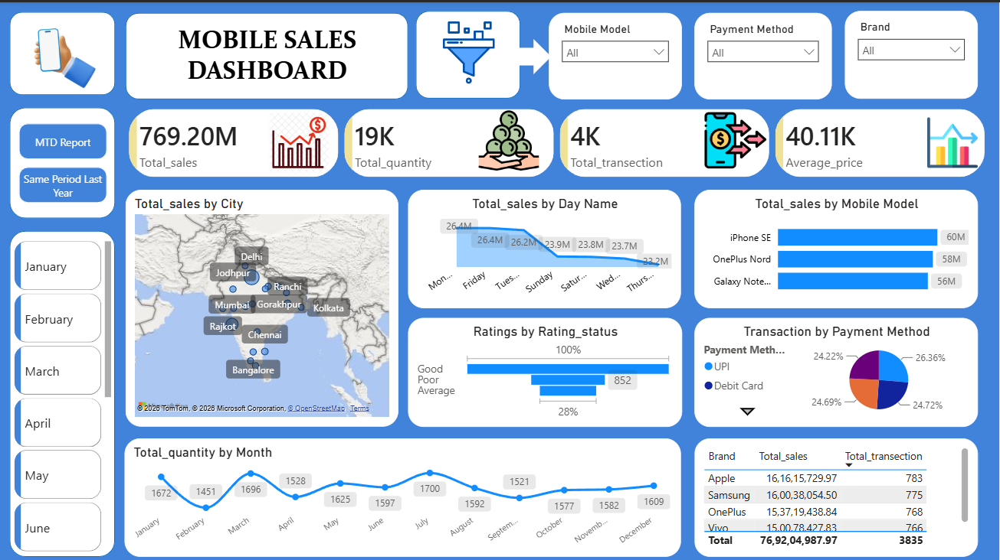
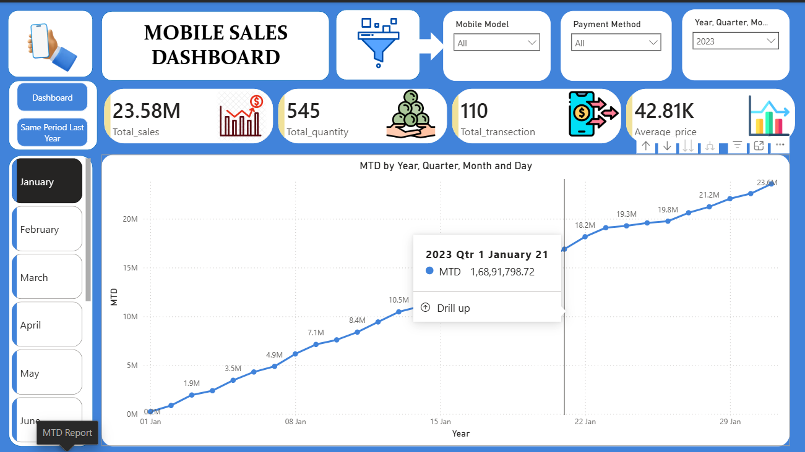
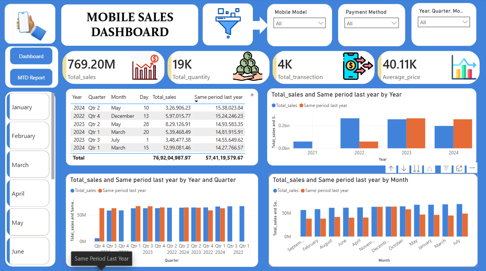

# 📊 Mobile Sales Dashboard - Power BI

## 📌 Project Overview

The Mobile Sales Dashboard is an interactive Power BI project designed to analyze and visualize mobile phone sales data. The dashboard provides actionable insights into sales performance, customer transactions, product trends, payment methods, and regional sales distribution.

By leveraging Power BI's visualization and data modeling capabilities, this project transforms raw sales data into meaningful business intelligence, helping stakeholders make data-driven decisions.

---

## 🎯 Objectives

- Monitor overall sales performance.
- Track Month-to-Date (MTD) sales trends.
- Compare current sales with the Same Period Last Year (SPLY).
- Analyze sales by brand, model, city, and payment method.
- Identify top-performing products and regions.
- Provide interactive filtering for deeper analysis.

---

## 📈 Key Metrics

| Metric | Value |
|----------|----------|
| Total Sales | 769.20M |
| Total Quantity Sold | 19K |
| Total Transactions | 4K |
| Average Selling Price | 40.11K |

---

## 📊 Dashboard Features

### Main Dashboard
- Total Sales Overview
- Total Quantity Sold
- Total Transactions
- Average Price Analysis
- Sales by City (Map Visualization)
- Sales by Mobile Model
- Sales by Day Name
- Payment Method Analysis
- Customer Rating Distribution
- Monthly Quantity Trend

### MTD Report
- Month-to-Date Sales Tracking
- Daily Sales Progression
- Interactive Drill-Down Analysis

### Same Period Last Year (SPLY)
- Year-over-Year Sales Comparison
- Quarterly Performance Analysis
- Monthly Trend Comparison

---

## 🛠️ Tools & Technologies

- Power BI
- Power Query
- DAX (Data Analysis Expressions)
- Data Modeling
- Data Visualization

---

## 📚 Skills Demonstrated

- Data Cleaning & Transformation
- Data Modeling
- DAX Measures & Calculations
- KPI Development
- Time Intelligence Functions
- Dashboard Design
- Interactive Reporting
- Business Intelligence

---

## Dashboard Preview

## 🔍 Business Insights

- Identified top-performing mobile models and brands.
- Analyzed customer purchasing behavior across payment methods.
- Compared current sales performance against historical trends.
- Tracked sales distribution across multiple cities.
- Evaluated customer satisfaction through rating analysis.

---

## 🚀 Learning Outcomes

This project enhanced my understanding of:

- Building end-to-end Power BI dashboards.
- Creating interactive visualizations.
- Implementing DAX measures for advanced analytics.
- Using Time Intelligence functions for trend analysis.
- Converting business requirements into actionable insights.

---

## 👨‍💻 Author

**Abhishek Kumar**

Aspiring Data Analyst | Excel | SQL | Power BI | Python

### Connect with Me

- LinkedIn: www.linkedin.com/in/abhishekkumar-dataanalyst
- GitHub: github.com/abhishek

---

⭐ If you found this project useful, please consider giving it a star!
